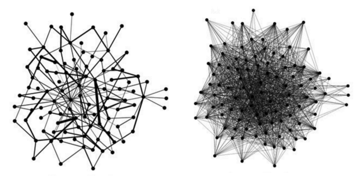
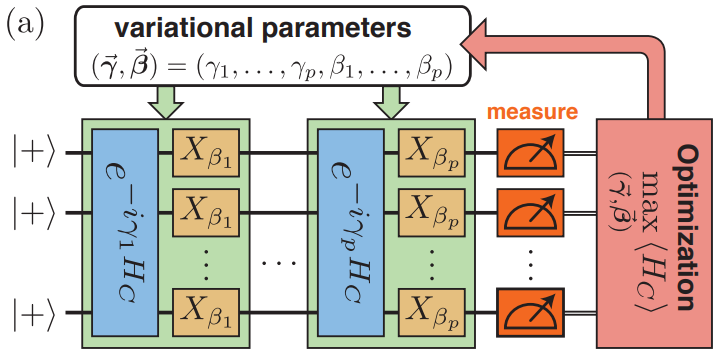

# ⚡🧠📊 QAOA-Formulation-Study: Exploring PUBO vs QUBO for PMU Placement on Sparse Power Networks ⚛️💻

This repository provides the framework and experimental pipelines developed in support of the study **“A Study of Hardware-Efficient PUBO Encodings for Sparse Graph Optimization: Application to PMU Placement”**, which investigates how different problem formulations impact quantum optimization efficiency and scalability for PMU placement in power system networks.

## 🌍 Motivation

Power system networks are **highly sparse and nearly planar**, making them ideal candidates to study how **problem formulation influences quantum optimization performance**.  

Key challenges include:

- Minimizing the number of PMUs while ensuring **full network observability**.  
- Handling **constraints efficiently** in a quantum framework (QUBO vs PUBO).  
- Reducing **circuit complexity** and enhancing **hardware efficiency** for near-term quantum devices.  

This study emphasizes that **formulation matters more than the optimization algorithm**, exploring how better encodings allow larger networks to be tackled efficiently.
| Sparse Graph | QAOA Architecture |
|-------------|------------------|
|  |  |


---

## 🧠 Approach

We encode the PMU placement problem using:

- 🔹 **QUBO formulations** with slack variables and penalties  
- 🔹 **PUBO formulations** without explicit constraints  

These encodings are solved with **QAOA (Quantum Approximate Optimization Algorithm)**, measuring:

- Solution quality (optimal, feasible, invalid)  
- Probability distributions over configurations  
- Circuit complexity: two-qubit gate counts, depth, and transpilation efficiency  

---

## 📊 Dataset & Experiment Features

- **Networks**: IEEE test cases (5, 9, 14, 24, 30, 39, 57, 118 buses)  
- **Problem Variations**: QUBO vs PUBO formulations, varying penalty parameters and QAOA depth  
- **Metrics**: 
  - Probability of obtaining optimal or feasible solutions  
  - CX gate counts before and after transpilation  
  - Scalability on sparse power networks  

---

## 🧪 Experiments

### Typical Experiments:

- Probability of obtain a (optimal,feasible,non-)solution in relation with QAOA depth (*p*) for a subset of penalty λ    
- CX gate counts before and after transpilation on multiple backends  
- Comparison of QUBO and PUBO formulations  

---

## 📁 Repository Structure
```bash
qaoa_formulation_study/
│
├── main.py # Entry point to run experiments
├── qaoa.py # QUBO/PUBO encodings + QAOA pipeline
├── power_system_graphs.py # Network generation and graph utilities
├── experiments.py # Pipelines for running probability & CX gate analysis
└── results/ # PDF plots and experimental outputs
```


---

## 🚀 Getting Started

Clone the repository:

```bash
git clone https://github.com/andysinx/qaoa-formulation-study.git
cd qaoa-formulation-study
pip install -r requirements.txt

---

## 🚀 Getting Started

Clone the repository:

```bash
git clone https://github.com/andysinx/qaoa-formulation-study.git
cd qaoa-formulation-study
pip install -r requirements.txt

Run experiments:

python main.py

