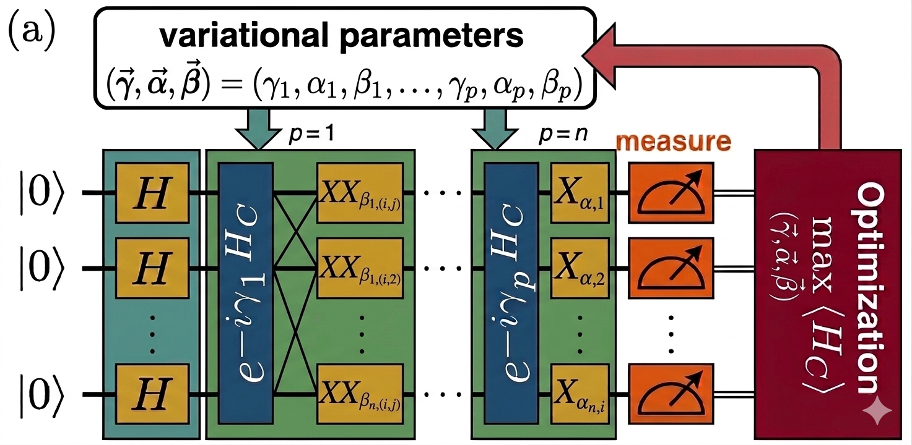

# ⚡🧠📊 QAOA-SoftQUBO-PMU: Graph-Aware Variational Optimization for PMU Placement ⚛️💻

This repository contains the full experimental framework supporting the study:

**“Soft-QUBO Relaxations with Graph-Aware QAOA for PMU Placement”**

The work investigates how different problem formulations (QUBO, PUBO, and relaxed penalty-based QUBO) and different QAOA mixing strategies (standard vs graph-aware) affect performance, scalability, and noise robustness in the **Optimal PMU Placement problem** for power systems.

---

| Sparse Graph | QAOA Architecture |
|-------------|------------------|
|  |  |

---

## 🌍 Motivation

Modern power grids are sparse and highly structured, making them ideal benchmarks for studying quantum optimization methods.

This work focuses on:

- ⚙️ The impact of **problem formulation on quantum performance**
- 📉 Trade-offs between **QUBO, PUBO, and relaxed formulations**
- 🧠 The role of **graph-aware variational dynamics in QAOA**
- 📡 Scalability on sparse power network topologies
- 🔊 Robustness under noise (finite shots + hardware emulation)

---

## 🧠 Key Insight

This study emphasizes that:

> **Formulation and variational structure matter more than the optimization algorithm itself**

We show that:

- Better encodings significantly improve trainability
- Graph-aware mixers introduce topology-driven correlations in the quantum dynamics
- Relaxed penalty formulations smooth the optimization landscape

---

## 🧪 Methodology Overview

We compare three formulations:

### 🔹 QUBO (Slack-based encoding)
- Constraints encoded via auxiliary variables
- Higher qubit overhead
- Standard quadratic formulation

### 🔹 PUBO (Polynomial encoding)
- No slack variables
- Compact register (N qubits)
- Higher-order interactions → harder optimization landscape

### 🔹 Soft-QUBO Relaxation (proposed)
- Quadratic penalty-based relaxation
- No auxiliary variables
- Smoother optimization landscape

---

## ⚛️ QAOA Variants

Two mixing strategies are studied:

### 🔸 Standard Mixer
- Independent RX rotations
- No structural bias

### 🔷 Graph-Aware Mixer (proposed)
- Two-body XX interactions aligned with graph edges
- Encodes topology into variational dynamics
- Induces correlated evolution of qubits

---

## 📊 Graph Instances

- IEEE-inspired power system networks
- Sizes: 5, 9, 14, 24, 30, 39, 57, 118 buses
- Sparse graph structure dominates all instances


## 🧪 Experiments

We evaluate:

### 📉 Optimization performance
- Probability of optimal / feasible solutions
- Sensitivity to QAOA depth (p)

### 🔊 Noise robustness
- Ideal simulation (shots = 0)
- Finite sampling (shots = 1024)
- Hardware noise (FakeWashingtonV2)

### ⚙️ Circuit complexity
- Two-qubit gate counts (before/after transpilation)
- Backend-dependent overhead

### 🧠 Optimizer comparison
- COBYLA, COBYQA, Nelder–Mead
- Genetic Algorithm (EVOVAQ)
- Particle Swarm Optimization (PSO)

---

## 📁 Repository Structure

```bash
code_experiments/
│
├── QUBOvsPUBO/
│   ├── QUBO_to_QAOA.py              # QUBO formulation + QAOA pipeline
│   ├── PUBO_to_QAOA.py              # PUBO formulation + QAOA pipeline
│   ├── experiments.py               # Experiment orchestration
│   ├── power_system_graphs.py       # IEEE / pandapower graph generation
│
├── Relaxed_QUBO_Graph_Aware_Mixer_vs_Standard_Mixer/
│   ├── relaxed_PUBO_gamixer.py      # Relaxed QUBO + graph-aware mixer
│   ├── relaxed_PUBO_stdmixer.py     # Relaxed QUBO + standard mixer
│
result_experiments/
│
├── QUBO/
│   ├── shots_0/
│   ├── shots_1024/
│   ├── shots_1024_noise/
│   ├── optimizer_comparison_*.pdf
│   ├── transpilation_analysis/
│
├── PUBO/
│   ├── shots_0/
│   ├── shots_1024/
│   ├── shots_1024_noise/
│   ├── optimizer_comparison_*.pdf
│   ├── transpilation_analysis/
│
├── Relaxed_QUBO_GraphAwareMixer/
│   ├── 9_nodes_instance/
│   ├── 24_nodes_instance/
│
├── Relaxed_QUBO_StandardMixer/
│   ├── 9_nodes_instance/
│   ├── 24_nodes_instance/
```


🚀 Getting Started
Clone repository
```
git clone https://github.com/your-repo/qaoa-pmu-study.git
cd qaoa-pmu-study
Install dependencies
pip install -r requirements.txt
Run experiments
```

QUBO / PUBO pipeline:
```
python code_experiments/QUBOvsPUBO/experiments.py
```
Relaxed QUBO with graph-aware mixer/standard mixer:
```
python code_experiments/Relaxed_QUBO_Graph_Aware_Mixer_vs_Standard_Mixer/relaxed_PUBO_gamixer.py
python code_experiments/Relaxed_QUBO_Graph_Aware_Mixer_vs_Standard_Mixer/relaxed_PUBO_stdmixer.py
```
📈 Key Contributions
📌 Unified framework for QUBO, PUBO, and relaxed formulations
📌 Soft penalty relaxation of observability constraints
📌 Graph-aware QAOA mixer with topology-dependent dynamics
📌 Full analysis under noise, sampling, and hardware constraints
📌 Large-scale experiments up to 24-node power networks
🧩 Main Takeaway
PUBO reduces qubits but increases optimization hardness
QUBO increases circuit overhead due to slack variables
Soft-QUBO provides a better balance between structure and trainability
Graph-aware mixers improve stability and feasibility under noise
📌 Reference

This repository supports the paper:

G. Acamporaa, E. Esposito, N. Paterakis, A. Senese - Soft-QUBO Relaxations with Graph-Aware QAOA for PMU Placement.

⚙️ Implementation Notes
Built with Qiskit v1.2.4 + Pennylane
Noise simulations: FakeWashingtonV2
Large-scale runs executed with GPU acceleration (lightning.gpu)
